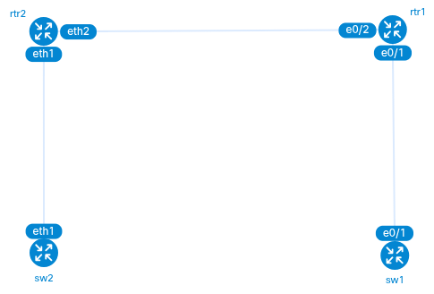
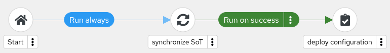

# Automating Network Configuration Management with Ansible and Configuration as Code approach
## Introduction

This project demonstrates an example of automating network configuration management using Ansible for multi-vendor network devices (Cisco & Arista). 
It showcases **Configuration as Code (CaC)** approach with **Source of Truth (SoT)** defined in Github where network configurations are defined in YAML files and deployed via Ansible playbooks. Two different configuration methods are presented here:

- **Declarative configuration** with Ansible **Network Resource modules**
- **Template-based configuration** with Ansible **Config modules** 

With CaC approach the best practice is to implement paradigm shift where we are switching to configuring network from SoT (this repository) instead of implementing changes directly on devices. Configuration is then automatically implemented on network devices using Ansible.

## Network Topology
The following lab environment was created with Containerlab:

  

- **rtr1**: Cisco IOS-XE Router (172.20.0.100)
- **sw1**: Cisco IOS-XE Switch (172.20.0.101) 
- **rtr2**: Arista EOS Router (172.20.0.102)
- **sw2**: Arista EOS Switch (172.20.0.103)

## Detailed Description
This project uses simple VLAN and interface configurations of devices sw1, sw2, rtr1 and rtr2 to showcase the configuration implementation concepts. The device configurations which serve as our SoT are stored in _configs_ folder. Each device has separate configuration subfolders depending on the Ansible module used:
1. For Config module: _'config_module'_ folder
2. For Network Resource modules: _'resource_modules'_ folder

In both approaches configuration data is decoupled from configuration syntax as the following:
#### Config Module approach:
- Data model: stored in _config_vars_ folders and based on custom Jinja2 templates
- Syntax: defined in Jinja2 templates in _templates_ folder


#### Resource Module approach:
- Data: stored in _config_vars_ folders and based on data structures defined by Resource modules
- Syntax: handled automatically by Ansible modules

### Github Actions
GitHub Actions workflow provides automated deployment of network configurations to devices via Ansible Automation Platform (AAP). It detects which configuration module is used and by using webhooks triggers the appropriate Workflow Job Template on AAP based on which folder contains the changes:

- `configs/**/config_module/**`
- `configs/**/resource_modules/**`


## Network configuration workflow
1. Modify network configuration in _configs_ directory
2. Stage, commit and push changes to main branch
```
git add .
git commit -m 'configuration x update'
git push
```
3. Github actions workflow automatically triggers webhook and runs the appropriate automation Workflow Job Template on Ansible Automation Platform

## AAP Workflow Job Templates
Two Workflow Job Templates are defined on AAP to implement configurations: one using Config module and a second one using Network Resource modules. These workflows have a simple structure:
1. **Synchronize SoT** to obtain the latest configuration from repository
2. **Deploy configuration** with the apropriate module

  

AAP Templates:
 


## Advanced concepts
In this project the following basic Configuration as Code related concepts have been presented:
- **Source of Truth**: intended configurations stored and version-controlled in Git
- **Configuration paradigm shift**: modify configurations in Git not directly on devices
- **Automated deployment**: Ansible automatically applies changes from SoT to devices


This framework can be further extended with more advanced concepts for example:
- **Configuration drift detection**: monitor and report unauthorized configuration changes
- **Automated remediation**: automatically revert drift to maintain SoT compliance
- **Rollback capabilities**: revert to previous configurations using Git history

## Remarks
Config modules are not declarative so they do not define configuration states. It is good practice to define states when creating Jinja2 templates (states are implemented in this project), it makes configuration removal process much easier.
Arista config module has 'replace: config' parameter which allows atomic configuration change. It is very beneficial for CaC approach because we don't have to track configuration states in case when the entire configuration is defined in Jinja2. To see the example of this approach see the following project: 
https://github.com/mzdyb/netdevops  

AAP Workflows used in this project are defined in CaC fashion in the following repo:
https://github.com/mzdyb/aap-configuration-as-code

## Author
[@mzdyb](https://www.linkedin.com/in/michal-zdyb-9aa4046/)
